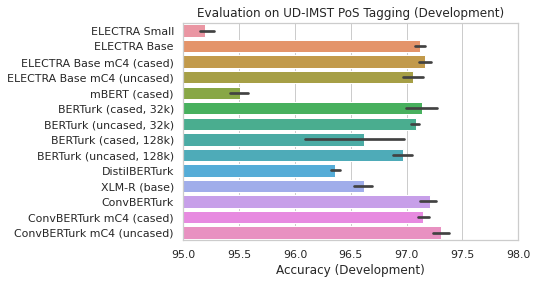
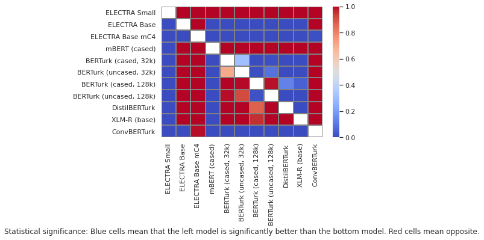
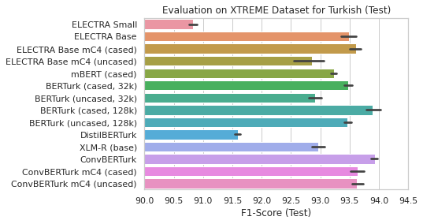
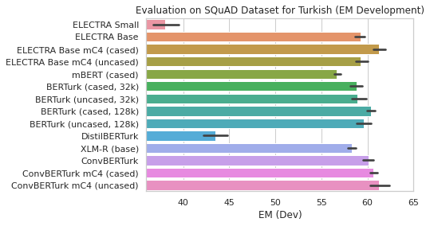
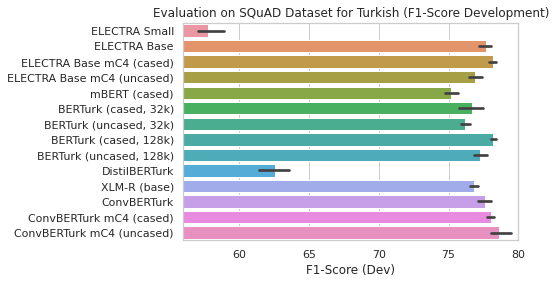

# 🇹🇷 BERTurk


[](https://zenodo.org/badge/latestdoi/237817454)

We present community-driven BERT, DistilBERT, ELECTRA and ConvBERT models for Turkish 🎉

Some datasets used for pretraining and evaluation are contributed from the
awesome Turkish NLP community, as well as the decision for the BERT model name: BERTurk.

# Changelog

* 24.06.2021: Release of new ELECTRA model, trained on mC4 dataset, repository got new awesome logo from  Merve Noyan.
* 16.03.2021: Release of *ConvBERTurk* model and more evaluations on different downstream tasks.
* 12.05.2020: Release of ELEC**TR**A ([small](https://huggingface.co/dbmdz/electra-small-turkish-cased-discriminator) 
              and [base](https://huggingface.co/dbmdz/electra-base-turkish-cased-discriminator)) models, see [here](electra/README.md).
* 25.03.2020: Release of *BERTurk* uncased model and *BERTurk* models with larger vocab size (128k, cased and uncased).
* 11.03.2020: Release of the cased distilled *BERTurk* model: *DistilBERTurk*.
              Available on the [Hugging Face model hub](https://huggingface.co/dbmdz/distilbert-base-turkish-cased)
* 17.02.2020: Release of the cased *BERTurk* model.
              Available on the [Hugging Face model hub](https://huggingface.co/dbmdz/bert-base-turkish-cased)
* 10.02.2020: Training corpus update, new TensorBoard links, new results for cased model.
* 02.02.2020: Initial version of this repo.

# Stats

The current version of the model is trained on a filtered and sentence
segmented version of the Turkish [OSCAR corpus](https://traces1.inria.fr/oscar/),
a recent Wikipedia dump, various [OPUS corpora](http://opus.nlpl.eu/) and a
special corpus provided by [Kemal Oflazer](http://www.andrew.cmu.edu/user/ko/).

The final training corpus has a size of 35GB and 4,404,976,662 tokens.

Thanks to Google's TensorFlow Research Cloud (TFRC) we can train both cased and
uncased models on a TPU v3-8. You can find the TensorBoard outputs for
the training here:

* [TensorBoard cased model](https://tensorboard.dev/experiment/ZgFk8LclQOKdW0pYWviLMg/)
* [TensorBoard uncased model](https://tensorboard.dev/experiment/5LlD11cWRwexyqKSEPPXGA/)

We also provide cased and uncased models that aŕe using a larger vocab size (128k instead of 32k).

A detailed cheatsheet of how the models were trained, can be found [here](CHEATSHEET.md).

## C4 Multilingual dataset (mC4)

We've also trained an ELECTRA (cased) model on the recently released Turkish part of the
[multiligual C4 (mC4) corpus](https://github.com/allenai/allennlp/discussions/5265) from the AI2 team.

After filtering documents with a broken encoding, the training corpus has a size of 242GB resulting in tokens.

We used the original 32k vocab (instead of creating a new one).

# *DistilBERTurk*

The distilled version of a cased model, so called *DistilBERTurk*, was trained
on 7GB of the original training data, using the cased version of *BERTurk*
as teacher model.

*DistilBERTurk* was trained with the official Hugging Face implementation from
[here](https://github.com/huggingface/transformers/tree/master/examples/distillation).

The cased model was trained for 5 days on 4 RTX 2080 TI.

More details about distillation can be found in the
["DistilBERT, a distilled version of BERT: smaller, faster, cheaper and lighter"](https://arxiv.org/abs/1910.01108)
paper by Sanh et al. (2019).

# ELECTRA

In addition to the *BERTurk* models, we also trained ELEC**TR**A small and base models. A detailed overview can be found
in the [ELECTRA section](electra/README.md).

# ConvBERTurk

In addition to the BERT and ELECTRA based models, we also trained a ConvBERT model. The ConvBERT architecture is presented
in the ["ConvBERT: Improving BERT with Span-based Dynamic Convolution"](https://arxiv.org/abs/2008.02496) paper.

We follow a different training procedure: instead of using a two-phase approach, that pre-trains the model for 90% with 128
sequence length and 10% with 512 sequence length, we pre-train the model with 512 sequence length for 1M steps on a v3-32 TPU.

# mC4 ELECTRA

In addition to the ELEC**TR**A base model, we also trained an ELECTRA model on the Turkish part of the mC4 corpus. We use a
sequence length of 512 over the full training time and train the model for 1M steps on a v3-32 TPU.

# Evaluation

For evaluation we use latest Flair 0.8.1 version with a fine-tuning approach for PoS Tagging and NER downstream tasks. In order
to evaluate models on a Turkish question answering dataset, we use the [question answering example](https://github.com/huggingface/transformers/tree/master/examples/question-answering)
from the awesome 🤗 Transformers library.

We use the following hyperparameters for training PoS and NER models with Flair:

| Parameter       | Value
| --------------- | -----
| `batch_size`    | 16
| `learning_rate` | 5e-5
| `num_epochs`    | 10

For the question answering task, we use the same hyperparameters as used in the ["How Good Is Your Tokenizer?"](https://arxiv.org/abs/2012.15613)
paper.

The script `train_flert_model.py` in this repository can be used to fine-tune models on PoS Tagging an NER datasets.

We pre-train models with 5 different seeds and reported averaged accuracy (PoS tagging), F1-score (NER) or EM/F1 (Question answering).

For some downstream tasks, we perform "Almost Stochastic Order" tests as proposed in the
["Deep Dominance - How to Properly Compare Deep Neural Models"](https://www.aclweb.org/anthology/P19-1266/) paper.
The heatmap figures are heavily inspired by the ["CharacterBERT"](https://arxiv.org/abs/2010.10392) paper.

## PoS tagging

We use two different PoS Tagging datasets for Turkish from the Universal Dependencies project:

* [IMST dataset](https://github.com/UniversalDependencies/UD_Turkish-IMST) 
* [BOUN dataset](https://github.com/UniversalDependencies/UD_Turkish-BOUN)

We use the `dev` branch for training/dev/test splits.

### Evaluation on IMST dataset

| Model                   | Development Accuracy | Test Accuracy
| ----------------------- | -------------------- | ----------------
| BERTurk (cased, 128k)   | 96.61 ± 0.58         | 96.85 ± 0.42
| BERTurk (cased, 32k)    | 97.14 ± 0.18         | 97.10 ± 0.07
| BERTurk (uncased, 128k) | 96.96 ± 0.11         | 97.06 ± 0.07
| BERTurk (uncased, 32k)  | 97.08 ± 0.05         | 97.09 ± 0.05
| ConvBERTurk             | **97.21** ± 0.10     | 97.35 ± 0.07
| DistilBERTurk           | 96.36 ± 0.05         | 96.56 ± 0.05
| ELECTRA Base            | 97.12 ± 0.06         | 97.23 ± 0.09
| ELECTRA Base mC4        | 97.17 ± 0.07         | **97.38** ± 0.05
| ELECTRA Small           | 95.20 ± 0.09         | 95.58 ± 0.10
| XLM-R (base)            | 96.62 ± 0.10         | 96.49 ± 0.06
| mBERT (cased)           | 95.50 ± 0.10         | 95.76 ± 0.05




Almost Stochastic Order tests (using the default alpha of 0.05) on test set:



### Evaluation on BOUN dataset

| Model                   | Development Accuracy | Test Accuracy
| ----------------------- | -------------------- | ----------------
| BERTurk (cased, 128k)   | 90.83 ± 0.71         | 91.02 ± 0.30
| BERTurk (cased, 32k)    | 91.46 ± 0.10         | 91.49 ± 0.10
| BERTurk (uncased, 128k) | 91.01 ± 0.15         | 91.29 ± 0.09
| BERTurk (uncased, 32k)  | 91.32 ± 0.19         | 91.54 ± 0.09
| ConvBERTurk             | 91.25 ± 0.14         | 91.52 ± 0.07
| DistilBERTurk           | 91.17 ± 0.10         | 91.04 ± 0.09
| ELECTRA Base            | 91.35 ± 0.04         | 91.53 ± 0.11
| ELECTRA Base mC4        | 91.40 ± 0.14         | 91.75 ± 0.11
| ELECTRA Small           | 91.02 ± 0.11         | 90.85 ± 0.12
| XLM-R (base)            | **91.83** ± 0.08     | **91.86** ± 0.16
| mBERT (cased)           | 91.29 ± 0.07         | 91.49 ± 0.11


## NER

We use the Turkish dataset split from the [XTREME Benchmark](https://arxiv.org/abs/2003.11080).

These training/dev/split were introduced in the ["Massively Multilingual Transfer for NER"](https://arxiv.org/abs/1902.00193)
paper and are based on the famous WikiANN dataset, that is presentend in the
["Cross-lingual Name Tagging and Linking for 282 Languages"](https://www.aclweb.org/anthology/P17-1178/) paper.

| Model                   | Development F1-score | Test F1-score
| ----------------------- | -------------------- | ----------------
| BERTurk (cased, 128k)   | **93.81** ± 0.08     | 93.91 ± 0.18
| BERTurk (cased, 32k)    | 93.47 ± 0.12         | 93.49 ± 0.09
| BERTurk (uncased, 128k) | 93.64 ± 0.10         | 93.49 ± 0.08
| BERTurk (uncased, 32k)  | 92.97 ± 0.09         | 92.92 ± 0.16
| ConvBERTurk             | 93.80 ± 0.19         | **93.96** ± 0.03
| DistilBERTurk           | 92.01 ± 0.09         | 91.60 ± 0.06
| ELECTRA Base            | 93.57 ± 0.08         | 93.48 ± 0.17
| ELECTRA Base mC4        | 93.60 ± 0.13         | 93.61 ± 0.12
| ELECTRA Small           | 91.28 ± 0.08         | 90.83 ± 0.09
| XLM-R (base)            | 92.97 ± 0.06         | 93.00 ± 0.15
| mBERT (cased)           | 93.30 ± 0.10         | 93.22 ± 0.07




## Question Answering

We use the Turkish Question Answering dataset from [this website](https://tquad.github.io/turkish-nlp-qa-dataset/)
and report EM and F1-Score on the development set (as reported from Transformers).

| Model                   | Development EM       | Development F1-score
| ----------------------- | -------------------- | --------------------
| BERTurk (cased, 128k)   | 60.38 ± 0.61     | **78.21** ± 0.24
| BERTurk (cased, 32k)    | 58.79 ± 0.81         | 76.70 ± 1.04
| BERTurk (uncased, 128k) | 59.60 ± 1.02         | 77.24 ± 0.59
| BERTurk (uncased, 32k)  | 58.92 ± 1.06         | 76.22 ± 0.42
| ConvBERTurk             | 60.11 ± 0.72         | 77.64 ± 0.59
| DistilBERTurk           | 43.52 ± 1.63         | 62.56 ± 1.44
| ELECTRA Base            | 59.24 ± 0.70         | 77.70 ± 0.51
| ELECTRA Base mC4        | **61.28** ± 0.94         | 78.17 ± 0.33
| ELECTRA Small           | 38.05 ± 1.83         | 57.79 ± 1.22
| XLM-R (base)            | 58.27 ± 0.53         | 76.80 ± 0.39
| mBERT (cased)           | 56.70 ± 0.43         | 75.20 ± 0.61





# Model usage

All trained models can be used from the [DBMDZ](https://github.com/dbmdz) Hugging Face [model hub page](https://huggingface.co/dbmdz)
using their model name. The following models are available:

* *BERTurk* models with 32k vocabulary: `dbmdz/bert-base-turkish-cased` and `dbmdz/bert-base-turkish-uncased`
* *BERTurk* models with 128k vocabulary: `dbmdz/bert-base-turkish-128k-cased` and `dbmdz/bert-base-turkish-128k-uncased`
* *ELECTRA* small and base cased models (discriminator): `dbmdz/electra-small-turkish-cased-discriminator` and `dbmdz/electra-base-turkish-cased-discriminator`
* *ELECTRA* base cased model, trained on mC4 corpus (discriminator): `dbmdz/electra-small-turkish-mc4-cased-discriminator`
* *ConvBERTurk* model with 32k vocabulary: `dbmdz/convbert-base-turkish-cased`

Example usage with 🤗/Transformers:

```python
tokenizer = AutoTokenizer.from_pretrained("dbmdz/bert-base-turkish-cased")

model = AutoModel.from_pretrained("dbmdz/bert-base-turkish-cased")
```

This loads the *BERTurk* cased model. The recently introduced ELEC**TR**A base model can be loaded with:

```python
tokenizer = AutoTokenizer.from_pretrained("dbmdz/electra-base-turkish-cased-discriminator")

model = AutoModelWithLMHead.from_pretrained("dbmdz/electra-base-turkish-cased-discriminator")
```

# Citation

You can use the following BibTeX entry for citation:

```bibtex
@software{stefan_schweter_2020_3770924,
  author       = {Stefan Schweter},
  title        = {BERTurk - BERT models for Turkish},
  month        = apr,
  year         = 2020,
  publisher    = {Zenodo},
  version      = {1.0.0},
  doi          = {10.5281/zenodo.3770924},
  url          = {https://doi.org/10.5281/zenodo.3770924}
}
```

# Acknowledgments

Thanks to [Kemal Oflazer](http://www.andrew.cmu.edu/user/ko/) for providing us
additional large corpora for Turkish. Many thanks to Reyyan Yeniterzi for providing
us the Turkish NER dataset for evaluation.

We would like to thank [Merve Noyan](https://twitter.com/mervenoyann) for the
awesome logo!

Research supported with Cloud TPUs from Google's TensorFlow Research Cloud (TFRC).
Thanks for providing access to the TFRC ❤️
